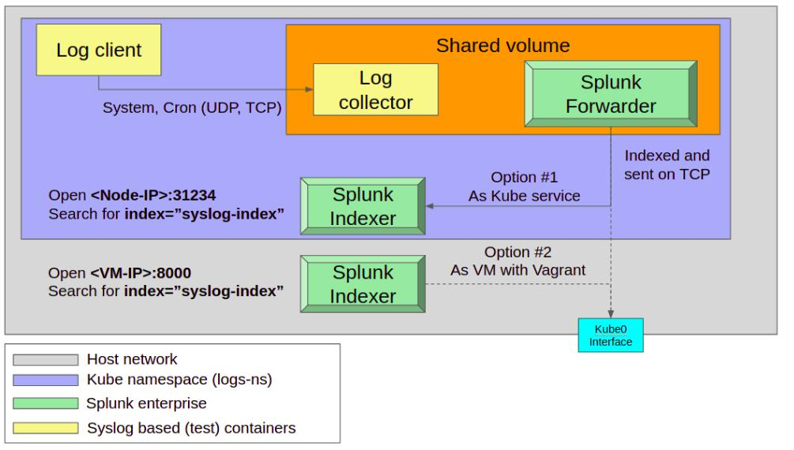

The system cotnains a syslog client which sends logs to syslog collector via UDP and TCP.  <br/>
The collector share a volume with a Splunk forwarder that send the data to Splunk receiver.  <br/>
You can choose to deploy the receiver inside the K8s cluster or outside in a dedicated VM (With vagrant).

Design:




Start with:  
<br/>
```./_start_script```
<br/>

After service is up - Get container Id from: 
<br/>
```kubectl describe pod --namespace=splunk-forwarder-standalone-ns```
<br/>

Will appear as: 
<br/> 
```Container ID:   docker://<The-container-ID>```
<br/>
And check splunk status with:
```docker exec -u root <containerID>  /opt/splunk/bin/splunk status```
<br/>

-----------
Debug with: 
```./_view_all_script```

<br/>
Please notice that all resources are created under namespace of ```splunk-forwarder-standalone-ns```
so don't forget to append ```--namespace=splunk-forwarder-standalone-ns``` as a postfix to all queries (get, describe, logs etc'). <br/>

After the cluster is up, navigate inside the indexer UI and search for: ```index="syslog-index"``` to view all logs.
<br/>


---


In case you deploy the indexer inside the kubernetes cluster - Please consider to allocate enough resources on your cluster.  <br/>

For example in a minikube cluster - go to ```~/.minikube/config/config.json``` and edit to:
```
{
    "cpus": 2,
    "dashboard": true,
    "memory": 4096
}
```

Or via CLI:
```
minikube config set memory 4096
minikube config set cpus 2
```

And as a one liner:
 
```minikube --memory 4096 --cpus 2 start```


---

In case you deploy the indexer with Vagrant:   <br/>
You have to download the Splunk enterprise package from ```https://www.splunk.com/en_us/download/sem.html```.  <br/>
Place it instead of this file: ```splunk-forwarder-to-indexer/indexer/setup-with-vagrant/lib/ADD_splunk-7.3.1-bd63e13aa157-linux-2.6-amd64.deb_IN_HERE``` . <br/>
            
If you want to save time and import the boxes locally on each ```vagrant up``` browse to:
```https://app.vagrantup.com/ubuntu/boxes/``` and select the version and the provider - in our case: bionic64. <br/>
Now check the Url, After choosing the provider and version you should add the postfix like the link below in order to download the box:  ```https://app.vagrantup.com/ubuntu/boxes/bionic64/versions/20190814.0.0/providers/virtualbox.box```.  <br/>            
Then save it in you filesystem and add it as a ```box_url```.


------------
Clear resources with: <br/> 
```./_destroy_script```
